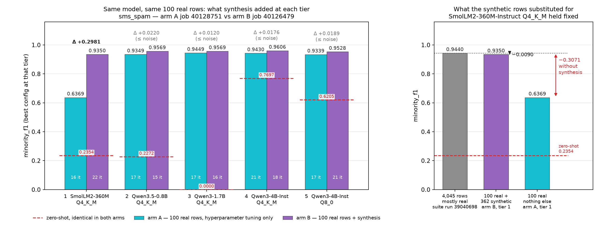
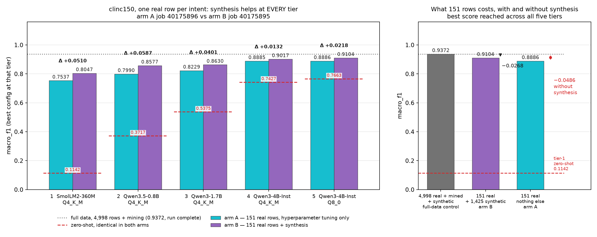
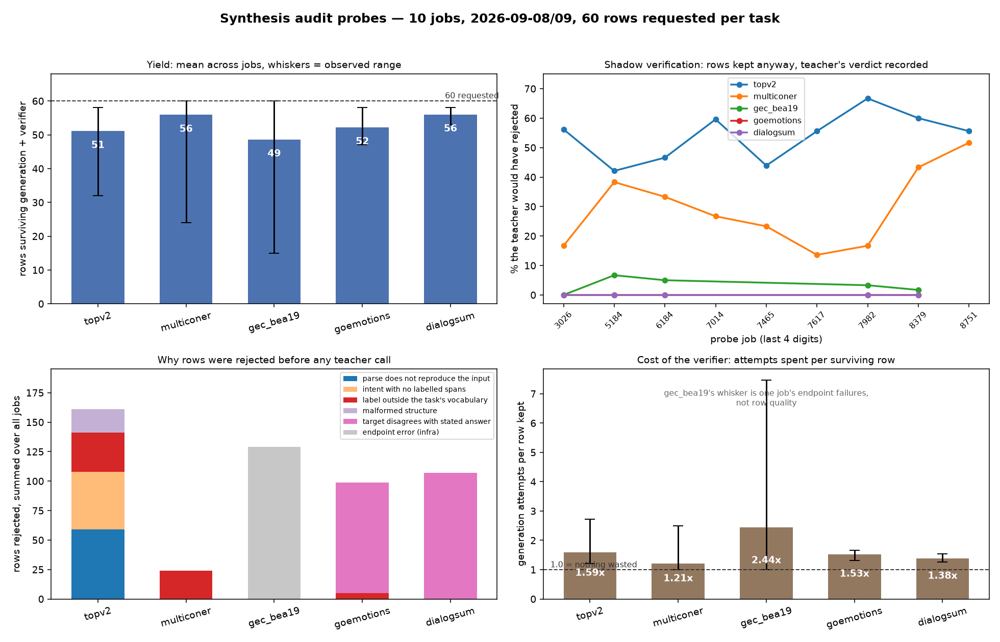

# 09-16 — Baselines, ablations, and probes (consolidated)

Four parts: the ten-task suite against frontier APIs and the local teacher (I), the ablation suite
on teacher choice, synthesis and curriculum reuse (II), whether synthetic data earns its keep when
real data is scarce (III), and the probe archive plus everything else (IV).

Every number is measured through the task's own `build_prompts` / `extract_predictions` / `score`
over the same frozen eval set the runs used, so a cell here is comparable to a `Score:` line in a
run log. Raw API data in `logs/probes/api-baselines.json`; run logs are under
`logs/slurm/Final Runs/`.

---

# Part I — The ten-task benchmark suite

## I.1 Main 10

| # | Task | What it is | Metric | Claude Sonnet 5 (0-shot) | DeepSeek v4 Flash (0-shot) | Local teacher (0-shot) | Local teacher (5-shot) | Student zero-shot | Best student &nbsp;&nbsp;&nbsp;&nbsp;&nbsp;&nbsp;&nbsp;&nbsp;&nbsp;&nbsp;&nbsp;&nbsp;&nbsp;&nbsp;&nbsp;&nbsp;&nbsp;&nbsp;&nbsp;&nbsp;&nbsp;&nbsp;&nbsp;&nbsp;&nbsp;&nbsp;&nbsp;&nbsp;&nbsp;&nbsp;&nbsp;&nbsp; | First fine-tune | Fine-tuning gain | Source log |
|-|-|---|-|---|---|---|---|-----|---|---|---|---|
| 1 | **clinc150** | 150-class intent classification | macro_f1 | 0.9212 | 0.9067 | 0.8771 | 0.9064 ‡ (Qwen3.6-35B-A3B) | 0.7663 | **0.9372** — T5 Qwen3-4B-Instruct-2507 @Q8_0 | 0.9010 | +0.0361 | `slm-clinc150-ablation-nostop-l40s-40105479.out` + `-40214984.out` (resume) |
| 2 | **sms_spam** | SMS spam detection, minority class | minority_f1 | 0.9538 | 0.8561 | 0.8641 | 0.8503 (Qwen3.6-35B-A3B) | 0.0000 | **0.9609** — T3 Qwen3-1.7B @Q4_K_M | 0.7071 | **+0.2539** | `slm-sms-spam-ablation-nostop-l40s-40105478.out` |
| 3 | **calendar_json** | Natural language → calendar JSON | ast_arg_match | 0.5140 | 0.5047 | 0.2037 | 0.6318 (Qwen3.6-35B-A3B) | 0.0523 | **0.8748** — T3 Qwen3.5-2B @Q4_K_M | 0.8168 | +0.0579 | `slm-calendar-json-l40s-39294409.out` |
| 4 | **xlam_bfcl** | Function calling from declared tools | ast_arg_match | 0.8790 | **0.8960** | 0.8660 | 0.8700 (deepseek-v4-flash) | 0.8480 | 0.8740 — T5 Qwen3-4B-Instruct-2507 @Q8_0 | 0.8510 | +0.0230 | `slm-xlam-bfcl-l40s-39361648.out` |
| 5 | **ner_bc5cdr** | Biomedical NER — chemicals, diseases | span_f1 | 0.1647 | 0.1277 | 0.1321 | 0.3348 (Qwen3.6-35B-A3B) | 0.0000 | **0.8532** — T3 Qwen3.5-2B @Q4_K_M | 0.8357 | +0.0175 | `slm-ner-bc5cdr-l40s-39311801.out` |
| 6 | **goemotions** | 28-label multi-label emotion | ekman_macro_f1 | 0.5062 | 0.4481 | 0.4227 | 0.4318 (Qwen3.6-35B-A3B) | 0.3775 | **0.5979** — T5 Qwen3-4B-Instruct-2507 @Q8_0 | 0.5979 | +0.0000 | `slm-goemotions-ckpt-39708679.out` |
| 7 | **gec_bea19** | Grammatical error correction, learner English | errant_f05 | 0.4758 | 0.5176 | 0.5014 | 0.5086 (Qwen3.6-35B-A3B) | 0.4352 | **0.5647** — T5 Qwen3-4B-Instruct-2507 @Q8_0 | 0.5358 | +0.0289 | `slm-gec-bea19-l40s-39881529.out` |
| 8 | **multiconer** | 33-class fine-grained NER | micro_f1 | 0.4912 | 0.4283 | 0.4306 | 0.5451 (Qwen3.6-35B-A3B) | 0.2844 | **0.6388** — T5 Qwen3-4B-Instruct-2507 @Q8_0 | 0.5692 | +0.0696 | `slm-multiconer-l40s-39881531.out` |
| 9 | **dialogsum** | Dialogue summarization, 3 references | rouge_l | 0.3342 | 0.3272 | 0.2843 | 0.3389 (Qwen3.6-35B-A3B) | 0.2721 | **0.4817** — T5 Qwen3-4B-Instruct-2507 @Q8_0 | 0.4817 | +0.0000 | `slm-dialogsum-l40s-39969104.out` |
| 10 | **topv2** | Nested intent/slot parsing, low-resource | exact_match | 0.2410 | 0.1450 | 0.0230 | 0.0180 (Qwen3.6-35B-A3B) | 0.0030 | **0.5990** — T5 Qwen3-4B-Instruct-2507 @Q8_0 | 0.5340 | +0.0650 | `slm-topv2-l40s-39969102.out` |

**How to read the student columns.** `Best student` is the best score any tier reached, and the tier
and quantization named beside it is the model that scored it; `Student zero-shot`, `First fine-tune`
and `Fine-tuning gain` all come from that same tier's row in the run's `Model Improvement Report`,
so the four are one model's story. Gain is best minus first fine-tune — what the iterative search
bought after the first training run, not what fine-tuning bought over the base model. Ladders are
five tiers except `calendar_json` and `ner_bc5cdr`, which stopped at three.

**How to read the teacher columns.** `Local teacher (0-shot)` is probe-measured for all ten (jobs
40102674 / 40102679, Part IV.2). `Local teacher (5-shot)` is each run's own teacher measurement —
the number that gated synthesis and set that run's goal — so the two columns come from different
code paths and should not be differenced. Part IV.2 has the single-path comparison. ‡ `clinc150`'s
run measured its teacher **0-shot** (0.8822), so its 5-shot cell is the probe's.

Corrections from the previous version of this table: `clinc150` and `sms_spam` now cite the
no-convergence reruns, which climb all five tiers rather than stopping at tier 1, raising their best
students from 0.8952 and 0.9440 to **0.9372** and **0.9609**. The gain column previously measured
best minus zero-shot, which is why every value in it has shrunk.

### Where the search actually paid — the highest-gain tier per task

The table above reports the tier that scored highest. This one reports the tier whose *search*
gained most — the largest `Δ search` in each run's `Model Improvement Report`, which is rarely the
same tier.

| # | Task | Metric | Highest-gain tier | Baseline | First fine-tune | Fine-tuning gain | …from hyperparameters | …from mine_new_real | …from synthesis | Best at that tier | Format valid | Also the best-scoring tier? |
|---|---|---|---|---|---|---|---|---|---|---|---|---|
| 1 | **clinc150** | macro_f1 | T4 Qwen3-4B-Instruct-2507 @Q4_K_M | 0.7427 | 0.8112 | **+0.1082** | **+0.0900** | +0.0177 | +0.0005 | 0.9194 | 0.9990 | no (T5) |
| 2 | **sms_spam** | minority_f1 | T3 Qwen3-1.7B @Q4_K_M | 0.0000 | 0.7071 | **+0.2539** | — | — | **+0.2538** | 0.9609 | 1.0000 | **yes** |
| 3 | **calendar_json** | ast_arg_match | T1 SmolLM2-360M-Instruct @Q4_K_M | 0.0000 | 0.4953 | **+0.1738** | — | **+0.1739** | — | 0.6692 | 0.9944 | no (T3) |
| 4 | **xlam_bfcl** | ast_arg_match | T1 gemma-3-270m-it @Q4_K_M | 0.0000 | 0.0050 | **+0.0410** | **+0.0360** | — | +0.0050 | 0.0460 | **0.3730** | no (T5) |
| 5 | **ner_bc5cdr** | span_f1 | T1 SmolLM2-360M-Instruct @Q4_K_M | 0.0000 | 0.6885 | **+0.0808** | **+0.0625** | +0.0028 | +0.0156 | 0.7694 | 0.9930 | no (T3) |
| 6 | **goemotions** | ekman_macro_f1 | T1 SmolLM2-360M-Instruct @Q4_K_M | 0.0624 | 0.4102 | **+0.1560** | +0.0391 | **+0.1066** | +0.0103 | 0.5662 | 0.9990 | no (T5) |
| 7 | **gec_bea19** | errant_f05 | T4 Qwen3-4B-Instruct-2507 @Q4_K_M | 0.4209 | 0.5149 | **+0.0359** | **+0.0238** | +0.0072 | +0.0049 | 0.5508 | 1.0000 | no (T5) |
| 8 | **multiconer** | micro_f1 | T3 Qwen3-1.7B @Q4_K_M | 0.0705 | 0.4546 | **+0.0749** | **+0.0500** | +0.0249 | — | 0.5296 | 0.9989 | no (T5) |
| 9 | **dialogsum** | rouge_l | T4 Qwen3-4B-Instruct-2507 @Q4_K_M | 0.2676 | 0.4462 | **+0.0339** | — | — | **+0.0340** | 0.4802 | 1.0000 | no (T5) |
| 10 | **topv2** | exact_match | T1 gemma-3-270m-it @Q4_K_M | 0.0000 | 0.2080 | **+0.2170** | **+0.0240** | — | **+0.1930** | 0.4250 | 1.0000 | no (T5) |

The three attribution columns are the tier's **kept** steps summed by strategy — a rolled-back
attempt contributed nothing — and they add up to that tier's `Δ search` for all ten tasks, to
rounding. A dash means the strategy either was never kept at that tier or never ran there. Taken
from each run's `Curriculum growth and score attribution per iteration` table, except
`calendar_json` and `ner_bc5cdr`, whose older reports only attributed their final tier; those two
are reconstructed from the `DAG Traversal` table by the same rule and reproduce `Δ search` to
0.0001.

**No single strategy owns the search.** Hyperparameters carried the tier on four tasks, synthesis on
three, mining on two, and `gec_bea19` split three ways. The two biggest gains in the table come
from opposite strategies — `sms_spam`'s +0.2539 is **99.96% synthesis** and `calendar_json`'s
+0.1738 is **entirely mining** — which is a caution against reading either the synthesis ablations
or the mining ones as a general verdict. `goemotions` is the one case where mining dominated a tier
outright (+0.1066 of +0.1560), and `topv2` is the clearest mixed case: synthesis +0.1930 with
hyperparameters adding +0.0240 on top.

**The search pays where the model starts furthest from the ceiling, which is almost never where the
run ends up.** Only `sms_spam` peaks in gain and in score at the same tier; on the other nine the
gain peaks lower down the ladder, and on five of ten it peaks at tier 1, the smallest model in the
pool. Once the run escalates, the bigger model's *first* fine-tune already lands near its plateau,
which is why the same column in the table above is so small at the top tiers.

Read the "best at that tier" column against the previous table before drawing conclusions: these
peaks are often far below what the task eventually reached (`calendar_json` 0.6692 against 0.8748,
`topv2` 0.4250 against 0.5990), so this is where tuning earns its keep, not where you would ship
from. `xlam_bfcl`'s row is the one to discount entirely — its highest-gain tier is a 270M gemma with
`format_valid=0.3730`, so +0.0410 is movement between two scores that were never usable.

### What it shows

**The fine-tuned student now wins 9 of 10 against both APIs.** `xlam_bfcl` is the only loss
(0.8740 against Claude's 0.8790 and DeepSeek's 0.8960), and it is the honest low point of the whole
suite: a 4B model already calls functions at 0.848 out of the box. Both short-classification tasks
flipped when they were allowed to climb the ladder — Claude beat the original clinc150 and sms_spam
runs, and loses to the reruns.

**The loop wins hardest where the base model cannot do the task at all**: `ner_bc5cdr` 0.0000 →
0.8532 against Claude's 0.1647, `calendar_json` 0.0523 → 0.8748 against 0.5140, `topv2` 0.0030 →
0.5990 against 0.2410. These are the format-bound extraction and structured-output tasks the
on-device case is about.

**Almost all of the gain is the first fine-tune, not the search after it.** The gain column's median
is +0.0289 and eight of ten tasks sit at or below +0.07; `goemotions` and `dialogsum` are at exactly
+0.0000, meaning the final tier's first training run was already its best. The one real exception is
`sms_spam` at +0.2539, and that is a collapse being repaired rather than a model improving — see
Part III.2. What the ladder contributes shows up as the difference *between* tiers, not in this
column.

**DeepSeek v4 Flash costs a ninth of Claude and trails by little**, beating it on `xlam_bfcl` and
`gec_bea19` and landing within 0.05 on five more.

### How much data each task actually had

`corpus` is what the offline loader can supply in total; `anchor / mined / synth` is what the final
curriculum was built from. These describe the original runs of all ten tasks — the two
no-convergence reruns cited above grew larger curricula (`sms_spam` to 5,323 rows, `clinc150` to
7,905).

| Task | Corpus available | Anchor | Mined | Synthetic | Final curriculum | New sources found |
|---|---|---|---|---|---|---|
| clinc150 | 15,250 | 2,764 | 0 | 234 | 2,998 | 0 |
| sms_spam | 4,128 | 2,931 | 974 | 140 | 4,045 | 0 |
| calendar_json | 3,929 | 3,000 | 900 | 355 | 4,255 | 0 |
| xlam_bfcl | 60,000 | 4,954 | 2,431 | 3,315 | 10,700 | 0 |
| ner_bc5cdr | 5,096 | 2,599 | 0 | 101 | 2,700 | 0 |
| goemotions | 43,311 | 4,997 | 2,891 | 1,214 | 9,102 | 0 |
| gec_bea19 | 33,781 | 4,889 | 5,095 | 570 | 10,554 | 0 |
| multiconer | 16,763 | 4,811 | 2,775 | 662 | 8,248 | 0 |
| dialogsum | 12,459 | 4,936 | 2,527 | 2,755 | 10,218 | 0 |
| topv2 | 84,346 | 4,975 | 0 | 824 | 5,799 | 0 |

**No task ever gained a row from a new external source** — not for lack of candidates. On
`ner_bc5cdr` Exa found eight BC5CDR datasets, and six were rejected by a comparison that cannot
succeed: `_KNOWN_DISCOVERED_BENCHMARKS` in `data/loaders/web_acquire.py` records BC5CDR's task as
`"NER"` while the registry task is `ner_bc5cdr`, and the gate is `if task != expected_task:
REJECTED`. One more was skipped because HuggingFace dropped loading-script support and one failed
for a real schema reason. Two such rounds retire `mine_new_real` permanently
(`MAX_FAILED_DISCOVERY_ROUNDS = 2`). Fixing it would mostly buy duplicates of the same corpus; the
tasks that would benefit from a genuinely different source are the thin ones — `ner_bc5cdr` (96
spare rows after the cap), `calendar_json` (929) and `sms_spam` (1,128).

`clinc150`, `ner_bc5cdr` and `topv2` mined nothing at all. For the first two that is the corpus
running dry; for topv2 it is by design, since the SPIS low-resource protocol fixes the adaptation
set at 678 rows.

### Caveats on individual numbers

* **multiconer 0.6388 clears the 0.6100 published SOTA but was trained on 27 of 33 entity types.**
  The 5,000-row cap was a prefix slice of an unshuffled CoNLL file, so six classes had zero training
  mentions while 198–388 examples of each sat unused. `micro_f1` is sound; the `macro_f1` report
  metric has six classes pinned at 0.0 by construction. The stratified-slice fix is in
  `data/loaders/multiconer.py`.
* **dialogsum uses max-over-3-references ROUGE**, so 0.4817 is not comparable to the
  single-reference 0.3945 published figure.
* **All five 09-2026 suite runs used `SLM_TEACHER_SYNTH_BYPASS=1`.** The teacher failed the 0.80
  synthesis fitness gate on every one and synthetic data was allowed anyway, so these are not clean
  results in the gate's terms. On `topv2` Part IV.1 sharpens this considerably: the teacher itself
  would have rejected roughly 54% of the rows it wrote.
* **Zero-shot API method:** thinking disabled on both APIs, full eval sets, Message Batches API for
  the 50% discount. DeepSeek needs `thinking={"type":"disabled"}` explicitly — left unset it
  reasons by default and bills the trace inside `max_tokens`. Total **$9.67** for all 20 cells,
  zero API errors, format validity 0.95–1.00 everywhere. Anthropic prompt caching is unavailable
  below a 1,024-token prefix and no task reaches it.
* **Three local-teacher 0-shot cells are depressed for a format reason, not a capability one**:
  `ner_bc5cdr` returned nothing at all on 600/1000 rows, `calendar_json` on 371/535, `multiconer`
  on 262/871. The APIs had no such problem.

---

# Part II — Ablations: teacher choice, synthesis, curriculum reuse, convergence

| # | Question | Arms | Verdict |
|---|---|---|---|
| 1 | Does carrying the curriculum across tier promotions help? | `39562028` reset-on-escalation | Mechanism verified live; no effect isolated, because it stopped at its goal |
| 2a/2b | Does the teacher model change the quality of generated rows? | `39562029` DeepSeek on ner_bc5cdr; `39562027` Qwen on xlam | Format validity, not capability — but the arm was handicapped by our own client, so it needs a re-run |
| 3 | Does synthetic data help at all? | `39562030` no-synth | Hyperparameter tuning alone matched the synthesis-enabled baseline at tier 1 |
| 4 | What do the two tasks that CONVERGED reach if not allowed to stop? | `40105478` sms_spam, `40105479` clinc150 | +0.017 and +0.042 over their original runs, by climbing tiers they never reached |
| 5 | Does synthetic data earn its keep when real data is scarce? | Part III | Yes at one row per class; negligible at 100 rows on a binary task |

## II.1 Teacher choice is about the output contract, not capability

Ablation 2b swapped the local 35B teacher for `deepseek-v4-flash` on `ner_bc5cdr`:

| Teacher | `span_f1` 5-shot | `format_valid` |
|---|---|---|
| Qwen3.6-35B-A3B (three identical runs) | 0.3348 / 0.3325 / 0.3299 | **1.0000** |
| deepseek-v4-flash | 0.3074 | **0.7040** |

The score gap is small; the format gap is not. Nearly 30% of DeepSeek's NER replies do not parse as
the task's output contract, and a second independent measurement on `xlam_bfcl` agrees
(`ast_arg_match=0.6790`, `format_valid=0.7630`). On format-bound tasks that is the more
consequential difference.

**The cause was ours.** `data/synth_client.py` sent the thinking-disable flag only on the local
path, so the API teacher reasoned on every row — 7,138 output tokens per generated row, $22.63 of
the suite's $28.84, and reasoning text leaking into replies is exactly how a strict contract fails
30% of the time. DeepSeek's flag is `thinking={"type":"disabled"}` and is now set per provider via
`_sampling_extra_body` (`SLM_SYNTH_API_THINKING`, in the resume fingerprint). `eval/judge_client.py`
had the identical gap while asking for `max_tokens=8`, so any API-mode run of a judged task
(`dialogsum`, `toolbench`) before that fix is suspect. **Ablation 2b's result should be treated as
measuring our client, not DeepSeek**, and re-run. 2a never ran at all — `39562027` sat `PENDING`
for ~40h on `AssocGrpGRES` and then a maintenance reservation.

Worth noting separately: the three Qwen measurements above span 0.0049 on an identical model,
prompt and eval set. The number that gates synthesis and sets the goal is not deterministic.

## II.2 No synthetic data: hyperparameter tuning alone held its own

`SLM_SYNTH_DISALLOW=1` refused synthesis for the whole run, and this arm is the one clean
comparison in the suite because it picked the same tier-1 model as the baseline:

| | tier-1 model | iters | tier-1 best | synthesis rounds |
|---|---|---|---|---|
| baseline `39311801` | SmolLM2-360M | 26 | 0.7694 | 2 |
| no-synth `39562030` | SmolLM2-360M | 30 | **0.7756** | **0** |

Hyperparameter tuning alone beat the synthesis-enabled baseline at tier 1, on a single run with four
more iterations and the same +96 mined rows. This is the result Part III was built to test properly,
and Part III explains why it holds here: `ner_bc5cdr`'s curriculum was 2,700 rows of which 101 were
synthetic, so synthesis never had room to matter.

## II.3 Curriculum reset on escalation: verified, but not measured

The mechanism fired correctly at the tier 1→2 promotion — `Dataset RESET to seed (ablation): v2 →
v3, 2621 → 2603 row(s)` — rewinding the grown curriculum to its seed and restoring the gold pool.
No effect on final score can be read off it, because the arm converged at tier 2 and stopped.

## II.4 The two converged tasks, not allowed to stop

`clinc150` and `sms_spam` were the only suite tasks that ever met their goal — in 4 and 7 iterations
respectively, both at tier 1, so neither ever escalated and the suite had no measurement of their
ceiling. Pinning `SLM_STOP_THRESHOLD=0.99` (`THRESHOLD_CEILING`) makes convergence unreachable, so
both climbed the full ladder:

| Task | Original run | No-convergence rerun | Where the best came from |
|---|---|---|---|
| sms_spam | 0.9440, 7 iters, tier 1 | **0.9609**, 85 iters, 5 tiers | T3 Qwen3-1.7B @Q4_K_M |
| clinc150 | 0.8952, 4 iters, tier 1 | **0.9372**, 104 iters, 5 tiers | T5 Qwen3-4B-Instruct-2507 @Q8_0 |

Both are the numbers Part I now reports. Two caveats. `sms_spam`'s peak is at tier 3 and its final
deployed tier scored 0.9490, so the ladder overshot its own best. And `clinc150`'s number is now
CONFIRMED rather than a lower bound. That run died at 1d13h on an infrastructure error — 
`convert_hf_to_gguf.py` exceeded a flat 600s ceiling on the merged 4B checkpoint while two other
runs were writing multi-gigabyte checkpoints to the same Lustre scratch — with its best set at
iteration 16 and still climbing. The ceiling now scales with source size and retries once on
timeout (`training/quantize.py`), and the run was resumed from its checkpoint as job `40214984`,
finishing 8h46m later: 46h and 104 iterations in total, ending on the same terminal rule as every
other run (tier-5 stagnation against the 30-eval cap). Its per-tier numbers came back unchanged and
its best is still 0.9372.

## II.5 Confounds to carry into any re-run

* **Pinning the threshold does not disable the orchestrator raising it.** The DeepSeek arm was
  pinned to 0.80 and raised itself to 0.85 anyway. Comparable endpoints need `SLM_THRESHOLD_RAISE=0`
  as well as `SLM_STOP_THRESHOLD`.
* **Stopping at the goal is not the same as reaching a ceiling.** All three ner arms stopped the
  moment they touched 0.8000 while the baseline raised its own goal and pushed to 0.8532 at tier 3.
  Comparing endpoints there measures the stretch-goal mechanism; per-tier numbers are the comparable
  ones. The decline reason is now logged with its margin instead of being inferred after the fact.
* **The orchestrator does not always pick the same tier-1 model**, which is why only the no-synth
  arm above supports a paired comparison.

---

# Part III — Does synthetic data earn its keep when real data is scarce?

Across the 09-2026 suite `surgical_synthesis` contributed +0.0083 (`gec_bea19`), +0.0413
(`multiconer`) and +0.0495 (`dialogsum`) — small next to hyperparameter tuning. The hypothesis is
that it never had room: those curricula were 5% to 31% synthetic, so thousands of real rows
dominated whatever the teacher produced. Two A/B pairs test it by starving a run of real data and
changing nothing else. Each pair's arms differ **only** in whether synthesis is allowed; the
launcher registry test enforces that by diffing both against the task's baseline launcher.

| | sms_spam pair | clinc150 pair |
|---|---|---|
| real rows | 100 (~50 per class, binary) | 151 (exactly one per intent, 151 classes) |
| arm A / arm B jobs | 40128751 / 40126479 | 40175896 / 40175895 |
| arm A → arm B final | 0.9339 → **0.9528** (+0.0189) | 0.8886 → **0.9104** (+0.0218) |
| full-data reference | 0.9440 (360M, 4,045 rows) | 0.9372 (5 tiers, 7,905 rows, run complete) |
| wall clock, A / B | 6h18m / 12h15m | 13h45m / 22h56m |
| Claude cost, A / B | $3.73 / $5.92 | $4.32 / $6.76 |

Both pairs pin the goal at 0.99 so neither arm can converge early, refuse `mine_new_real` so the cap
cannot be read back out of the same corpus, and lower `MIN_CURRICULUM_ROWS` because a curriculum this
small is exactly what that guard exists to catch.

## III.1 sms_spam, 100 real rows: two true answers

**At the run level synthesis bought almost nothing** — 0.9339 against 0.9528, and 0.9449 against
0.9606 comparing lifetime bests. **On the same model it was decisive:**

| Tier | Model | Zero-shot | arm A best (iters) | arm B best (iters) | Δ |
|---|---|---|---|---|---|
| 1 | SmolLM2-360M-Instruct Q4_K_M | 0.2354 | 0.6369 (16) | **0.9350** (22) | **+0.2981** |
| 2 | Qwen3.5-0.8B Q4_K_M | 0.2272 | 0.9349 (17) | 0.9569 (15) | +0.0220 |
| 3 | Qwen3-1.7B Q4_K_M | 0.0000 | 0.9449 (17) | 0.9569 (16) | +0.0120 |
| 4 | Qwen3-4B-Instruct-2507 Q4_K_M | 0.7697 | 0.9430 (21) | 0.9606 (18) | +0.0176 |
| 5 | Qwen3-4B-Instruct-2507 Q8_0 | 0.6205 | 0.9339 (17) | 0.9528 (21) | +0.0189 |

The two readings disagree because of the **model ladder**: arm A reached the task's ceiling by
escalating to a 4B model, arm B reached it at 360M. Tiers 2–5 differ by less than the ±0.015 noise
floor and should be read as no measured difference; the +0.2981 at 360M is twenty times it.

**What synthesis substituted for.** Holding the model at the 360M the suite actually deployed:
4,045 mostly-real rows score 0.9440, 100 real + 362 synthetic score 0.9350, and 100 real alone
score 0.6369. Deleting 97.5% of the real data costs 0.3071; letting the teacher write 362 rows puts
back all but 0.0090 of it.

**A config-matched control, stronger than the arm-level comparison.** Both arms ran the identical
default config (`r=16 a=32 wd=0.01 lr=2e-04 ep=3`) on the identical 100-row file (md5-verified) and
both scored **0.2353** with 819/1000 eval failures. Arm B then ran that same config on 100 real +
208 synthetic rows and scored **0.7700** with 49 failures. Two further pairs match on config across
arms: `r=32 a=64 wd=0.05 lr=1e-04 ep=5` gives 0.6369 on 100 rows against 0.8111 on 308, and
`r=64 a=128 wd=0.05 lr=1e-04 ep=5` gives 0.3303 against 0.8927. Arm A was not unlucky — it ran 16
fine-tunes spanning rank 16–64, lr 5e-5 to 2e-4 and 3–6 epochs, and every one landed between 0.2353
and 0.6369.

**How to read the early iterations of any scarce run.** Iteration 1 of every tier uses the same
cold-start default and iteration 2 is the orchestrator's first move, so the jump between them
recurs at every tier and is a threshold moving, not new skill. Reconstructed from the logs'
confusion counts (128 spam rows in 1,000):

| Tier | it1 → it2 | it1 precision/recall | it2 precision/recall | accuracy it1 → it2 |
|---|---|---|---|---|
| 1 | 0.2354 → 0.6369 | 0.134 / 0.945 | 0.496 / 0.891 | 0.145 → 0.870 |
| 3 | 0.6310 → 0.9061 | **1.000 / 0.461** | 0.949 / 0.867 | 0.931 → 0.977 |
| 5 | 0.7595 → 0.8641 | 0.638 / 0.938 | 0.780 / 0.969 | 0.924 → 0.961 |

Tier 3 is the clearest case: at iteration 1 it had perfect precision, flagging 59 messages and
being right on all 59 while missing 69. A 4.6-point accuracy move reads as a 27.5-point F1 move.
The cause is a prior mismatch specific to the cap — the 100-row anchor is 50/50 spam/ham while the
eval stream is 12.8% spam (the full-data anchor was 17.3%) — and the trainer cannot see it, because
its 12-row validation split scored 0.1600 against 0.1581 for two models 0.40 F1 apart.

## III.2 clinc150, one real row per intent: synthesis wins at every tier

`clinc150` is the follow-up sms_spam could not provide, because sms_spam saturates near 0.96 and
leaves at most 0.03 of headroom above 0.93. Here there are 151 classes under `macro_f1` and a
full-data best of only 0.9372. The cap is 151 rather than 100 because the loader draws it
round-robin across labels (`stratified_by_label`), so 151 lands exactly one example on every intent
— verified before launch: 151 rows, 151 distinct intents, one each, no eval intent missing from
training. At 100 rows a third of the intents would have had zero examples in both arms and the
comparison would have measured coverage instead.

| Tier | Model | Zero-shot | arm A best | arm B best | Δ |
|---|---|---|---|---|---|
| 1 | SmolLM2-360M-Instruct Q4_K_M | 0.1142 | 0.7537 | **0.8047** | **+0.0510** |
| 2 | Qwen3.5-0.8B Q4_K_M | 0.3717 | 0.7990 | **0.8577** | **+0.0587** |
| 3 | Qwen3-1.7B Q4_K_M | 0.5375 | 0.8229 | **0.8630** | **+0.0401** |
| 4 | Qwen3-4B-Instruct-2507 Q4_K_M | 0.7427 | 0.8885 | **0.9017** | +0.0132 |
| 5 | Qwen3-4B-Instruct-2507 Q8_0 | 0.7663 | 0.8886 | **0.9104** | +0.0218 |

**Synthesis wins at every tier, and at four of five by more than the noise floor** — unlike
sms_spam, where only tier 1 separated. Arm B's advantage does not vanish as the model grows: it is
+0.0218 at the top of the ladder, where sms_spam's was indistinguishable from noise. Arm A pinned at
151 rows never gets past 0.8886, while arm B grows to 1,576 rows (1,425 synthetic, 90%) and reaches
0.9104, which is within 0.0268 of the full-data control's 0.9372 on 7,905 rows including mining.

The attribution tables say the same thing from the other side. Arm A spent its entire run on
hyperparameters, keeping 26 of 91 attempts for +0.6633. Arm B kept 21 of 50 hyperparameter attempts
for +0.5351 and 10 of 37 synthesis attempts for +0.0845 — the synthesis steps did less of the
lifting than the tuning did, but they raised the ceiling that tuning was working against.

Controls held: identical zero-shot baselines at all five tiers to four decimals, teacher measured at
0.8837 and 0.8847 (0-shot, jitter 0.0010), both arms terminated on the same rule (stagnation →
escalate → no feasible models above tier 5), both `did NOT converge` as designed, and arm A's
curriculum column reads 151 for all 96 of its iterations. Early stopping was disabled in **both**
arms, and that is required by the design rather than a preference: the trainer carves a random,
unstratified 12% validation split, which at one row per class would strip 18 intents of their only
training example and let synthesis take credit for repairing a holdout artifact.

## III.3 What the two pairs say together

**The hypothesis is right about the mechanism.** Real data dominating the curriculum was why
synthesis looked weak in the suite: the same strategy worth +0.008 to +0.050 at thousands of rows is
worth +0.0510 to +0.0587 per tier at one row per class, and the final curricula here were 90–94%
synthetic instead of 5–31%.

**Whether it raises the run's score depends on how much headroom the task has.** On `sms_spam` it
did not, because every model at or above 0.8B reached 0.93+ from 100 real rows alone and escalation
was free — synthesis and model size were substitutes, and the only place it mattered was the 360M
model that could not get there on its own. On `clinc150` it did, at every tier and at the top of the
ladder, because 151 rows over 151 classes is scarce in a way a bigger model cannot compensate for.

**The practical rule.** Synthesis pays when the model you have to ship is too small to learn the
task from the rows you have, or when the label space is too large for the rows to cover it. If you
are free to escalate and the task is nearly saturated, a bigger model buys the same score for half
the wall clock; on-device you are usually not free to escalate, which is the case for keeping
synthesis in the loop.

**Limits.** Two tasks, one seed each, and both are classification. `sms_spam`'s ceiling compresses
its comparison. Synthetic volume is not monotone — on sms_spam the same config scored 0.8111 on 308
rows and 0.6526 on 462. And arm B costs roughly 1.7–1.9x the wall clock and $2–2.5 more per run.

**Training is not bit-reproducible, and this was measured rather than assumed.** The clinc150 arms'
first fine-tunes ran on the same md5-identical 151-row file, the same config, batch and LR schedule,
a seeded LoRA init (Unsloth's `random_state=3407`), a seeded shuffle, identical peak memory
(2,592 MiB) and greedy decoding — and still finished at `train_loss` 1.096 against 1.093, scoring
0.2781 against 0.2934. Their recorded `effective_config` differs in exactly two keys: the ablation
switch itself and a log path.

Probe **40222458** establishes the cause: training the same file twice with identical arguments
produced two different adapters (sha256 `933f037f…` against `f6c9ba31…`). Nothing in the harness
asked for determinism, so bf16 reduction order followed runtime scheduling. That is now fixed —
seeds, `CUBLAS_WORKSPACE_CONFIG`, cuDNN flags and `use_deterministic_algorithms` are applied in
`training/determinism.py` and logged by every run — but it does NOT make training bit-exact:
probes 40253558, 40253685, 40253741 and 40253871 all still produced differing adapters, including
across separate processes and with `torch.compile` disabled. PyTorch emits no nondeterminism
warnings, so the residue is in Unsloth's fused kernels, which that flag does not reach.

**The size of the effect depends far more on how a checkpoint is SCORED than on the training
difference itself.** Probes 40254317 and 40254741 scored the same two independently-trained
adapters three ways, on identical rows:

| Same two adapters, scored… | arm 1 | arm 2 | gap |
|---|---|---|---|
| bf16, 5,500-row report split | 0.3403 | 0.3390 | **0.0013** |
| Q4_K_M, 5,500-row report split | 0.2798 | 0.2859 | **0.0061** |
| Q4_K_M, 1,000-row in-loop eval (the arms above) | 0.2781 | 0.2934 | **0.0153** |

Training nondeterminism is worth about **0.001**. Four-bit quantization multiplies it roughly
fivefold — rounding to 4 bits is a threshold operation, so weights differing in their last bits
land in different buckets, and `format_valid` moves 0.755 against 0.740 where in bf16 it moved
0.657 against 0.655. The 1,000-row selection eval multiplies it again, because macro-F1 over 151
classes has ~6.6 eval rows per class there against ~36 on the report split.

**The eval is not the noisy part.** Probe 40256115 re-scored both arms' saved iteration-1 adapters
against each run's own frozen eval set, twice each: arm A returned 0.2781/0.2781 against its
reported 0.2781, and arm B 0.2943/0.2943 against 0.2934. Three of four re-scored checkpoints were
bit-stable across passes and one moved 0.0018, so eval variance is ≤0.002 and the 0.0153 gap is two
genuinely different models measured accurately.

Two consequences. A per-tier margin near ±0.015 in the tables above is not attributable to the arm,
so the clinc150 claim rests on the sign being the same at all five tiers and four of them clearing
that band. And **paper numbers should come from `scripts/report_eval.py`**, not from the in-loop
figure: the same nondeterminism costs 0.0013 there against 0.0153 in the loop. Note this is a
different quantity from the ±2.5-point figure in that script's docstring, which is the sampling CI
for one absolute score at n=1,000 and cancels in a paired comparison on fixed rows.
`logs/probes/repro_determinism.py`, `repro_quant_amplifier.py` and `rescore_saved_checkpoints.py`
reproduce these checks; the follow-up analysis is in `09-17-scarcity-followups.md`.

---

# Part IV — Probes, other runs, and retention

## IV.1 Other tasks run outside the main 10

| Task | What it is | Metric | Teacher (5-shot) | Best student | Zero-shot, same model | Fine-tuning gain | Source log |
|---|---|---|---|---|---|---|---|
| **gsm8k** | Grade-school math word problems | exact_match | — | **0.8263** (Qwen3.5-4B) | 0.7913 | +0.0350 | `2nd runs/slm-math-l40s-37576194.out` |
| **routerbench** | Route query to local model or cloud | accuracy | — | **0.7467** (Qwen3-4B-Instruct) | 0.5443 | +0.2024 | `3rd runs/slm-routerbench-l40s-38493142.out` |
| **proactive_listening** | Should the assistant interrupt now | macro_f1 | 0.3156 | **0.8892** (Qwen3-0.6B) | 0.1983 | +0.6909 | `3rd runs/slm-proactive-listening-cse-38569609.out` |
| **toolbench** | Multi-step real API tool use | tooleval_pass_rate | 0.0171 | **0.1737** (SmolLM2-360M) | 0.0000 | +0.1737 | `5th runs/slm-toolbench-l40s-38832586.out` |

Gains here are zero-shot to best on the same model, the older convention. `gsm8k` and `routerbench`
predate teacher calibration, so those cells are blank rather than zero.

## IV.2 Synthesis audit probes

Ten jobs on 09-08/09 driving the real `data/curriculum.py::synthesize_examples` against a local
`Qwen/Qwen3.6-35B-A3B`, asking for **60 rows per task** and recording yield, why the programmatic
verifier dropped rows, and — in `SLM_VERIFY_SYNTH=shadow` — what the teacher-as-verifier *would*
have rejected. The logs are deleted; this is the surviving record.

**Shadow verification — the percentage the teacher would have rejected:**

| task | 39873026 | 39875184 | 39876184 | 39877014 | 39877465 | 39877617 | 39877982 | 39878379 | 39878751 |
|---|---|---|---|---|---|---|---|---|---|
| topv2 | 56.2 | 42.1 | 46.6 | 59.6 | 43.9 | 55.6 | 66.7 | 60.0 | 55.6 |
| multiconer | 16.7 | 38.3 | 33.3 | 26.7 | 23.3 | 13.6 | 16.7 | 43.3 | 51.7 |
| gec_bea19 | 0.0 | 6.7 | 5.0 | — | — | — | 3.3 | 1.7 | — |
| goemotions | 0.0 | 0.0 | 0.0 | — | — | — | 0.0 | 0.0 | — |
| dialogsum | 0.0 | 0.0 | 0.0 | — | — | — | 0.0 | 0.0 | — |

**Row quality is a property of the task's output contract, not of synthesis.** On the two
structured-parse tasks the teacher would throw away between a seventh and two thirds of what it just
wrote — `topv2` never drops below 42% across nine independent jobs, mean 54% — while the free-text
and label-set tasks reject essentially nothing. Every row was kept anyway, which is what shadow mode
means, so `topv2`'s 824 synthetic rows in Part I should be read as roughly 450 the teacher itself
would not have accepted.

**Yield out of 60 requested** ran 54–60 for multiconer and 32–58 for topv2, at 1.21x (multiconer) to
1.59x (topv2) generation attempts per kept row. Nothing is free; nothing is ruinous.

**Why rows were rejected before any teacher call**, summed over all jobs:

| task | reason | rows |
|---|---|---|
| topv2 | parse does not reproduce the input utterance | 59 |
| topv2 | intent labelled with no spans at all | 49 |
| topv2 | label outside the closed 82-intent / 84-slot vocabulary | 33 |
| topv2 | malformed structure (unbalanced brackets, or more than one tree) | 20 |
| multiconer | entity type outside MultiCoNER's 33 classes | 24 |
| goemotions | trained target disagrees with the graded label set | 94 |
| goemotions | label outside the 28 GoEmotions names | 5 |
| dialogsum | generated row carries 2 or 3 references when it has one author | 107 |
| gec_bea19 | endpoint error — infrastructure, not row quality | 129 |

`topv2`'s dominant failure is coverage rather than vocabulary: 59 rows whose parse leaves do not
reproduce the command word-for-word (`'remind me to milk'` for `'remind me to buy milk'`), against
33 that invented a label. `multiconer`'s 24 are all plausible synonyms for real classes — `OtherORG`
(10), `Location` (5), `Loc` (2) — and the scorer compares labels exactly, so each can only score as
wrong. `dialogsum`'s 107 are a schema mismatch: the task grades against three references and a
generated row has one author.

## IV.3 Teacher few-shot probes

Seven jobs on 09-09 and 09-13. Every cell they produced, all against the frozen eval sets:

| task | metric | condition | score | empty / failed |
|---|---|---|---|---|
| clinc150 | macro_f1 | 0-shot / 5-shot | 0.8771 / **0.9064** | 0 / 1000 |
| sms_spam | minority_f1 | 0-shot / 5-shot | 0.8641 / **0.9213** | 0 / 1000 |
| topv2 | exact_match | 0-shot / 5-shot | 0.0230 / **0.1290** | 0 / 1000, 15 / 1000 |
| xlam_bfcl | ast_arg_match | 0-shot | 0.8660 | 15 / 1000 |
| gec_bea19 | errant_f05 | 0-shot | 0.5014 | 0 / 1000 |
| multiconer | micro_f1 | 0-shot | 0.4306 | **262 / 871** |
| goemotions | ekman_macro_f1 | 0-shot | 0.4227 | 21 / 1000 |
| dialogsum | rouge_l | 0-shot | 0.2843 | 0 / 500 |
| calendar_json | ast_arg_match | 0-shot | 0.2037 | **371 / 535** |
| ner_bc5cdr | span_f1 | 0-shot | 0.1321 | **600 / 1000** |

**Demonstrations are worth most where the output contract is hardest to guess** — topv2 +0.1060
(5.6x), sms_spam +0.0572, clinc150 +0.0293 — the same ordering as the empty-output column. The shot
ladder on topv2 (job 39880756, 150 rows) is convex rather than saturating: 0.0139 at 0-shot, 0.0203
at 1, 0.0748 at 3, **0.1934** at 5. Nothing suggests five is the right number and the ladder was
never run past it.

**The ±0.015 noise floor quoted throughout this note comes from here.** Jobs 40104499/501/502 ran
the same two tasks three times with nothing varied: sms_spam 0-shot moved 0.8552 / 0.8641 / 0.8834,
a 0.0282 spread with no demonstrations to vary. Few-shot won in all six pairings. Independently, the
teacher fitness measurement jitters 0.0049 across three identical runs (II.1). Treat any single-run
delta below that as unmeasured.

Endpoint startup dominated these jobs: vLLM took 525–1720s to come up against 25–350s of scoring.

## IV.4 What the two campaigns say together

**The teacher is a bad student and a decent generator, on different tasks.** It scores 0.0230 on
topv2 zero-shot and 0.1290 with five demonstrations, yet writes topv2 rows its own programmatic
verifier accepts 90% of the time. Generating a labelled example and answering a held-out one are not
the same capability, and the fitness gate measures only the second.

**The verifier layer carries real weight, and only for structured tasks.** Zero content rejections
on goemotions and dialogsum, hundreds on topv2 and multiconer. If synthesis is ever run without
shadow mode, those two are where the drop rate will be felt.

## IV.5 Log retention — deleted on 2026-09-16

Paths in earlier notes that point at these will not resolve; the tables and figures here are the
surviving record.

| Deleted | Why it is gone |
|---|---|
| `slm-dialogsum-ckpt-39719569`, `slm-gec-bea19-ckpt-39708678`, `slm-multiconer-ckpt-39719568`, `slm-topv2-ckpt-39720077`, `slm-topv2-l40s-39881378` | superseded by the runs Part I cites |
| `slm-xlam-ablation-qwen-39562027` | never started — ~40h `PENDING`, then `ReqNodeNotAvail` |
| `slm-clinc150-ckpt-39090966` | died 21s in; the vLLM synth endpoint never came up, nothing trained |
| `slm-calendar-json-l40s-38832587` | 13GB for an uninterpretable curve — the score was a per-fit coin flip on emitting EOS, over a teacher measuring 0.5400 against the 0.80 gate. Per-iteration table kept in `08-26-overnight-suite-postmortem.md` §2 |
| `slm-xlam-bfcl-l40s-39361189` | aborted after `initial_gold`, zero training attempts. Its one salvageable number is in II.1 |
| `slm-synthesis-audit-probe-*` (10 jobs), `slm-teacher-fewshot-probe-*` (7 jobs), and their `logs/probes/*.json` | summarised in IV.2 and IV.3 |

Kept deliberately: `logs/probes/api-baselines.json` (the raw data behind Part I.1's API columns),
`token-headroom.json`, `small-models-quant-38765655.json`, `suite-harness-39863800.json`, and every
suite run log cited in Part I.
