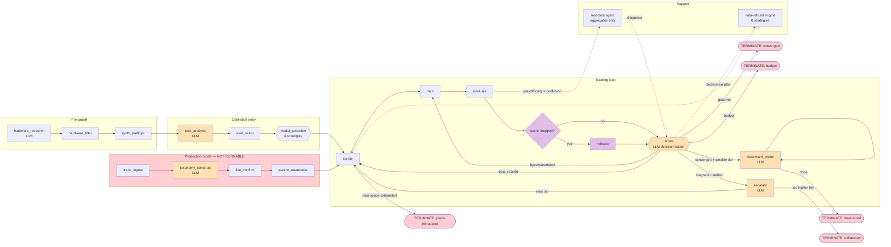

# Miro handoff prompt — SLM Factory pipeline diagram

Copy everything between the `--- BEGIN` and `--- END` markers into Miro AI (or any diagram
generator). It is self-contained: no repo access needed.

Verified against code on 2026-07-29. Source of truth: [`PIPELINE.md`](PIPELINE.md).

---

--- BEGIN PROMPT ---

Create a flowchart diagram of an agentic machine-learning pipeline called **SLM Factory**. It
autonomously fine-tunes small language models for on-device deployment. Use a left-to-right
layout with the iteration loop as a visually distinct cluster.

## Visual conventions

- **Rectangles** = graph nodes (units of work)
- **Diamonds** = decision points
- **Rounded rectangles** = pre-graph / post-graph steps that run outside the state machine
- **Cylinders** = persisted artifacts
- **Solid arrows** = control flow
- **Dashed arrows** = data flow / references
- **Red arrows** = termination paths
- Color code by concern:
  - blue = setup / one-time
  - green = the training loop
  - orange = decisions made by an LLM
  - purple = decisions made by deterministic rules
  - grey = artifacts
  - red = terminal states

Label every edge with its condition. Mark each LLM-driven node with a small robot icon and each
deterministic node with a gear icon.

Also create a seperate unconnected node that serves as the key to understanding the conventions

## Swimlane 0 — Pre-graph (rounded, blue)

1. `hardware_research` — resolves a free-text phone description into a RAM + storage budget.
   3 stages: local device CSV → Exa web search fallback → LLM resolve. **LLM.**
2. `hardware_filter` — 2 stages. Stage 1 filters the model pool on on-disk size vs storage and
   RAM. Stage 2 runs an on-device check that is a no-op before training exists. **Deterministic.**
3. `synthesis_preflight` — blocks until a local vLLM synthesis server answers; aborts the run if
   it never does. **Deterministic.**

Output: `feasible_models` (sorted largest → smallest).

## Swimlane 1 — Cold-start entry (rectangles, blue)

Linear chain: `task_analysis` → `eval_setup` → `model_selection` → (enters the loop at `curate`)

- **`task_analysis`** — **LLM.** Classifies the task into one of five types
  (classification / NER / math_reasoning / code_generation / generation), picks labels, search
  queries, curriculum size, eval size, and the accuracy stop threshold. Sets an immutable
  threshold floor.
- **`eval_setup`** — **Deterministic.** Acquires data and builds the held-out eval set
  `E = E_pos ∪ E_neg ∪ E_boundary` at a fixed 40% / 40% / 20% ratio. Runs **before any
  training** and is frozen for the whole run. Also labels every eval row easy/medium/hard by
  running the smallest and largest base models zero-shot once (easy = both correct, medium = only
  the large one, hard = neither).
- **`model_selection`** — one of four interchangeable strategies. Show these as four alternative
  boxes inside a dashed container labeled "strategy — configurable":
  - `smallest_first` (default) — pick smallest, escalate on failure. No probe cost. **Deterministic.**
  - `largest_first` — probe the largest to test feasibility, then drop to smallest. 1 extra
    training run. **Deterministic.**
  - `interpolation` — train 3 probes, fit F1 vs log weight size, pick closest to the RAM target.
    3 training runs. **Deterministic.**
  - `orchestrator_choice` — LLM picks. 1 API call. **LLM.**

  Annotate: only `interpolation` and `orchestrator_choice` can reach `downward_probe` later.

## Swimlane 2 — The loop (green cluster, the visual centerpiece)

Core cycle: **`curate` → `train` → `evaluate`**, then a decision fan-out.

- **`curate`** — **Deterministic** (executes an LLM-authored plan). Builds one dataset artifact
  from a declarative rebuild plan. **Skipped entirely if the last intervention was a
  hyperparameter change** (the dataset is held fixed) — draw this as a bypass arrow labeled
  "intervention ≠ data_rebuild → dataset held fixed".
- **`train`** — **Deterministic.** Trains one LoRA adapter. **Always from the base model, never
  from a prior adapter** — call this out with a note. Holds hyperparameters at the current best
  whenever the change was data-only, so the data change is isolated.
- **`evaluate`** — **Deterministic.** Scores the model. On iteration 1 also measures the zero-shot
  baseline, **and enters that baseline as a competing candidate** — if fine-tuning does not beat
  the base model, the base model is kept. Writes one node to a lineage DAG capturing the triple
  π = (D=dataset, H=hyperparameters, S=supervision).

### Decision 1 (diamond, purple): regression check

From `evaluate`: `is score[-1] < score[-2]?`
- **yes** → `rollback`
- **no** → `iterate`

### `rollback` (rectangle, purple)

Pops the regressing score, marks the DAG node pruned, restores the best non-pruned checkpoint
along with its dataset, plan, and eval report.

**Critical edge: `rollback` → `iterate`, NOT → `train`.** Annotate this prominently: "training is
deterministic, so re-running the same config would regress again forever — the loop is forced to
choose a *different* action."

### `iterate` — the decision node (large diamond cluster, orange)

Draw as a **numbered decision ladder, evaluated strictly top to bottom**. Mark which steps cost
an API call.

| # | Check | Result | API call |
|---|---|---|---|
| 1 | turn budget exhausted | → TERMINATE | no |
| 2 | wall-clock budget exhausted | → TERMINATE | no |
| 3 | score ≥ stop threshold | → converged sub-ladder (below) | no |
| 4 | stagnant (best gain over last 50 evals < 0.02) **or** stalled (50 consecutive non-improving evals) | → `escalate` | **no** |
| 5 | otherwise | ask the orchestrator LLM | **yes** (1, + up to 1 retry) |

Annotate step 4: "escalation on stagnation is a rule the LLM cannot override, so no API call is
spent — and plateauing is exactly when the loop runs most often."

**Converged sub-ladder (step 3), in order:**
1. running a `largest_first` feasibility probe? → switch to the smallest model → `curate`
2. hardware gate fails? → **not accepted as terminal**; route deterministically without an API call
3. strategy is `interpolation` or `orchestrator_choice` and an untried smaller tier exists →
   `downward_probe`
4. otherwise → **TERMINATE (success)**

**LLM decision output (step 5)** — exactly one of two mutually exclusive branches. Draw as a
fork labeled "discriminated union — never both":
- **`data_rebuild`** → `curate`. Carries a bounded declarative plan.
- **`hyperparameter`** → `train`. Carries up to 5 tunable fields.

Show the LLM's failure ladder as a small side-chain:
`API transport error → ABORT THE RUN` (red) · `malformed JSON → 1 retry` ·
`retry fails → test-agent suggestion` · `no suggestion → static score bands`

### `escalate` (rectangle, orange)

Promotes to the **nearest higher non-empty size tier**; an LLM picks which model within that
tier. Resets per-model state (scores, DAG, iteration counter, best score) but **carries the
dataset forward** and preserves a lifetime-best score. → `curate`.
If no higher tier exists → **TERMINATE (exhausted)** (red).

### `downward_probe` (rectangle, orange, with a self-loop)

Post-convergence resource optimization: find the *smallest* model that still clears the goal.
Two durable phases per pass — **plan** (choose a candidate, checkpoint the choice) then
**execute** (train + evaluate). Uses a single fixed hyperparameter config.
- clears the goal → adopt the smaller model, self-loop to try even smaller
- misses the goal → stop
- **always terminates the graph** (red arrow to TERMINATE)

## Swimlane 3 — Support systems (side panel, dashed connections into the loop)

- **Test-data agent** (grey) — owns the held-out eval set. Reports **only aggregates** to the
  decision node: per-difficulty accuracy, top-8 confusion pairs, and a diagnosis. **Never raw
  examples.** Label this "contamination firewall".
  Its diagnosis logic: `easy bucket < 0.6` → data problem · `medium/hard < 0.6` → capacity
  problem · `above goal` → converged.
- **Data-rebuild engine** (grey) — 6 strategies the LLM chooses from:
  `resample_existing`, `preserve_elite_resample`, `mine_new_real_source`,
  `source_diversification`, `difficulty_weighted_sampling`, `targeted_synth_positive`
  (last one is classification/NER only). Plans are content-hashed so an exact repeat is
  forbidden; when the plan space is exhausted the run terminates cleanly instead of crashing.
- **Contamination firewalls** — draw as 4 small shield icons at their locations:
  1. at `eval_setup` — raises on any train/test text overlap
  2. at `curate` — drops overlapping candidate rows
  3. at `iterate` — recursively rejects held-out text in any decision field
  4. at the retry path — redacts eval text from error messages before replaying them

## Swimlane 4 — Global guards (a band across the top, red)

Every single node is wrapped by a guard that runs **before** the node body:
- cumulative node-execution cap (1500) → raise
- wall-clock budget exceeded → **skip the node entirely** and terminate gracefully

Annotate: "this is why a long training or evaluation step can never start near the deadline and
get killed mid-write."

Also show: **any LLM API transport error aborts the whole run** — never a silent fallback.

## Swimlane 5 — Artifacts (cylinders, grey, right edge)

`dataset_v{N}.jsonl` · `eval_set.json` · LoRA adapter checkpoints · quantized GGUF files (kept
only for new-best iterations) · lineage DAG · `data-curation.md` trajectory log · SQLite graph
checkpoint + JSON mirror · cost ledger

## Swimlane 6 — Production mode (separate small diagram, offset below)

A second entry chain that replaces swimlane 1 and then **joins the identical loop**:

`trace_ingest` → `taxonomy_construct` (LLM clusters failures) → `live_confirm` (re-runs the
deployed model to confirm failures are systematic) → `parent_awareness` (builds a regression set
and a replay buffer) → `curate` → (same loop)

Mark this whole chain with a warning badge: **"not runnable end-to-end — requires an eval set the
graph never builds."**

## Terminal states (red, collect at the right edge)

1. **Converged** — accuracy goal met
2. **Converged + downsized** — a smaller model adopted after probing
3. **Exhausted** — no larger model tier available
4. **Budget** — turn or wall-clock limit reached
5. **Infeasible** — the largest model could not reach the goal (`largest_first` only)
6. **Plan space exhausted** — no untried data rebuild remains; best model preserved
7. **API failure** — aborted deliberately rather than continuing on fallbacks

--- END PROMPT ---

---

## If Miro chokes on the length

Give it this Mermaid graph first, then feed the prose above as annotation guidance.

## Facts most diagram tools get wrong — check these in the output

1. `rollback` must point at `iterate`, **not** `train`.
2. `downward_probe` must have a **self-loop**.
3. `curate` must have a **bypass** for hyperparameter interventions.
4. The `escalate → train` edge exists in code but is **unreachable** — omit it or dash it.
5. Steps 1–4 of the `iterate` ladder must be marked **no API call**.
6. The zero-shot baseline is a **competing candidate**, not just a reference number.
7. Every edge is conditional — there are no unconditional transitions.
